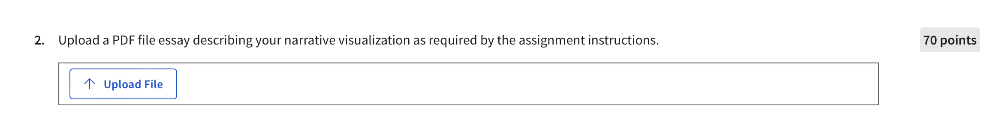

---
ANSWER
---

## URL:
https://preethiv07.github.io/CS416-Data-Visualization-FinalProject/

## Title: 
Chicago Crime Analysis Narrative Visualization

## Caption:

Using a Martini Glass Hybrid Structure ⁃ From Author-Driven Insights explanatory to Reader-Driven exploratory scenes to narrate Chicago's Crime Trends and Arrest Rates for Domestic vs. Non-Domestic Incidents.
**Dataset: **
This dataset reflects reported incidents of crime that have occurred in the City of Chicago over the past year. Data is extracted from the Chicago Police Department's CLEAR (Citizen Law Enforcement Analysis and Reporting) system.
⁍ Additional details about the dataset: https://catalog.data.gov/dataset/crimes-one-year-prior-to-present
⁍ Data is obtained from data.gov site: https://catalog.data.gov/dataset/crimes-one-year-prior-to-present/resource/e3a0a89d-cab5-4280-b6a5-20a1781139c3
⁍Data is processed, summarized for visualization through excel: https://github.com/preethiv07/CS416-Data-Visualization-FinalProject/tree/main/data

### **References:**
⁍  Narrative Structure: https://gurmanbhatia.com/talk/2021/03/09/stories-structure.html
⁍  Line chart animation: https://medium.com/@louisemoxy/create-a-d3-line-chart-animation-336f1cb7dd61
⁍ Banner: https://www.freepik.com/free-vector/flat-chicago-skyline-silhouette_48041417.htm#query=chicago%20skyline&position=3&from_view=keyword&track=ais_user&uuid=09680958-6a02-491b-86a8-ef451a24ec92
⁍  Custom Annotation: https://d3-graph-gallery.com/graph/custom_annotation.html